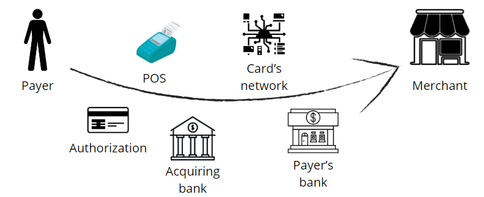

# CloudWalk - Risk Analyst case

By Gabriel Sprecher Dutra

## Understanding the industry

  

#### The money flow
In the payment industry, money flow involves the movement of funds from a payer to a payee. It typically starts with the payer initiating a transaction, which is processed by various intermediaries such as banks, card networks, and payment processors. These intermediaries facilitate the transfer of funds from the payer's account to the payee's account. Simultaneously, there's an information flow which includes data related to the transaction such as payment details, authorization codes, and transaction status. The main players in this ecosystem include issuers (banks or financial institutions issuing payment cards), acquirers (banks or financial institutions that process transactions on behalf of merchants), card networks (such as Visa, Mastercard, etc., which facilitate communication between issuers and acquirers), payment processors (entities that handle the technical aspects of transaction processing), and merchants (sellers of goods or services).

#### Differences between acquirer, sub-acquirer and payment gateway
Acquirers, sub-acquirers, and payment gateways play distinct roles in the payment processing ecosystem. An acquirer is typically a bank or financial institution that directly processes transactions for merchants. A sub-acquirer, on the other hand, is an intermediary that works with merchants on behalf of an acquirer. They often provide additional services such as risk management or specialized processing. A payment gateway is a technology platform that facilitates online transactions by securely transmitting payment data between merchants and acquirers. The flow changes for these players in terms of their specific responsibilities within the payment process. Acquirers directly handle transaction processing, while sub-acquirers act as intermediaries between merchants and acquirers, and payment gateways facilitate the exchange of payment information between merchants and acquirers.

#### Chargebacks and cancellations
Chargebacks occur when a cardholder disputes a transaction with their issuing bank, requesting a refund. Chargebacks can result from various reasons such as unauthorized transactions, disputes over goods or services, or fraudulent activity. Unlike cancellations, which are initiated by either the merchant or the customer before the transaction is completed, chargebacks involve the intervention of the cardholder's bank after the transaction has already been processed. Chargebacks are closely connected with fraud in the acquiring world because they can be a result of fraudulent transactions, either initiated by malicious actors or due to identity theft. Merchants and acquirers often face financial losses and penalties associated with chargebacks, making fraud prevention and detection crucial aspects of their operations.

## Solving a chargeback dispute issue

So, first of all, the main key is to demonstrate empathy towards the client. It's a situation involving their money, hence it's such a big deal and all respect and understanding is necessary with all parts involved.

In the payment's indutry, chargebacks are always reviwed based on concrete evidence sent by both parts involved. In this specific case, the cardholder, probably unsatisfied with the delay in the shipping, started a dispute with their issuing bank.

Therefore, the issuing bank investigated the dispute based on evidence provided by the cardholder, reviewed it, determined that it's validity and sent a notification to the payment gateway, which is when we act.

In this scenerio, we have already talked to the client, he has sent us his evidence which could include proof of delivery, signed contracts, or communication records. Afterall, everything is sent to the issuing bank so they can take a final decision about the chargeback.

In this case, as the issuing bank has declined the evidence sent, there are some things that can still be attempted:

- Explain to the client, in a simplified way, how chargebacks occurs in the payments industry. 

- Ask them for even more evidence of the shipment that they may haven't sent earlier. Since the product was shipped, sending the proof of shipment can be really important to change the issuing bank's final decision.

- Regardless of the outcome of the situation, orientating the client to always gather proof of sales and shipment is very important to prevent incorrect chargebacks in the future. They may haven't gathered as much evidence as necessary throughout the process, which could have led to an unfortunate result.

## Analyzing transaction data
Despite all analysis made in 'data_analysis', I've gathered the most interesting patters I've found here:

The dataset has 3.199 transactions in total, where 391 of them have chargeback, which means that 12.22% of them are marked as fraud.

####

## The anti fraud mechanism

After all data analysed, I came to the conclusion that the best way to create a simple fraud would be to create a neural network to analyze the most supicious patterns present on transaction amount, date of transaction and time of transaction and join it with a script to verify users, merchants, devices and card numbers with a high chargeback amount (>20%).

The Scripts can be found inside the folder 'anti-fraud-mechanism' and can be tested using the function 'check_transaction'. 

## Final considerations

This whole case was a big challenge for me since I've worked mostly as a software developer and this is the first time I explore deeply the deep learning world, so I really hope you liked my solution! :)